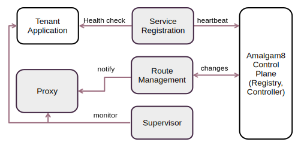
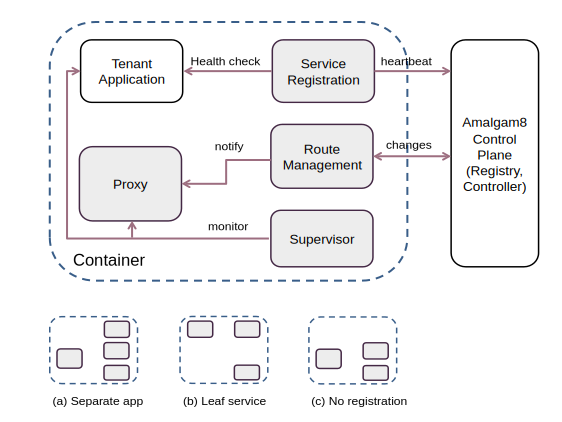
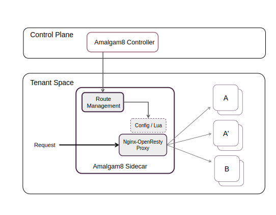

## Amalgam8 Sidecar

The Almagam8 sidecar has a flexible architecture that can be configured and
used by applications in a number of ways. The sidecar can be split into the
following functional components:

* **Service Registration** - Registers a microservice instance in the Registry and sends periodic heartbeats.
* **Route Management** - Receives route updates from the Controller and updates the Proxy without disruption.
* **Supervisor** - Manages the lifecycle of an Amalgam8 Proxy server and optionally the associated microservice itself.
* **Proxy** - An [OpenResty-based Nginx](https://openresty.org/en/) server  that acts as a request forwarder and load-balancer.

### Deployment Options 

There are two deployment options for the
sidecar. One option is to run it as *a separate process in the same
container alongside the application*. This usage model applies to any
container-based environment and requires that the sidecar binaries be
bundled along with the application in the same Docker image. Amalgam8
provides convenient Docker images packaged with the sidecar, that can be
used as microservice application base images. The sidecar binary can also
be built and installed individually or be distributed as installation
packages (e.g., deb, rpm, etc.).

Another option, specific to Kubernetes, is to run a sidecar container per
pod. Each pod would have the microservice running in one container and the
sidecar in another. In both deployment options outlined above, the
application would access the sidecar in the same manner, namely:
http://localhost:6379/servicefoo/foobarapi

### Configuration Options 

Depending on the nature of the microservice, only some
or all of the components of the sidecar may be needed. As shown in the
figure below, a microservice that requires service registration, makes
outbound calls to other microservices, and requires app supervision might
use all of the components of the sidecar. On the other hand, a leaf
microservice that does not make any outbound calls requires only the
service registration component of the sidecar (b). In Kubernetes, the
sidecar would typically be deployed as a separate container without the app
(a). Service Registration would not be needed for services in a runtime
that supports auto registration (c), for example, when using the amalgam8
registry adapter for Kubernetes.  The sidecar provides various
[command line flags](https://github.com/amalgam8/sidecar) to disable
components that are not needed.

### Programmable Proxy 

All calls to Amalgam8 microservices are routed via the Proxy component in
the sidecar. The Proxy enables the Amalgam8 Controller to manage traffic
between all the microservices in the application. Typically, the Proxy
component is deployed in the sidecar configuration, thus serving as a
decentralized client-side load-balancer. There are two exceptions that
should be noted:

- If the application owner wishes to use the DevOps functions for
  user-facing microservices, an instance of the sidecar with just the Proxy
  component needs to be deployed as an API gateway, in front of the
  user-facing microservices.
- By routing API calls to third-party services such as social media, maps,
  etc., via the Proxy component, it is possible to leverage DevOps functions 
  such as failure-recovery testing between the microservice and third-party
  dependencies.

The Amalgam8 Proxy implementation uses [Nginx](https://nginx.org/en/) with
the [OpenResty/Lua](https://openresty.org/en/) extension as the Proxy
engine as shown in the following diagram:

The Route Management component of the sidecar process queries the Amalgam8
Controller, in the control plane, to obtain the routing and configuration
information for the Nginx servers. The sidecar updates Nginx via REST API
exposed by the Lua-based management layer in the Nginx proxy.

At the Nginx layer, incoming requests are passed on to the the appropriate
Lua functions, which will route the request to an appropriate service, or
version of a service, and then load balance to an appropriate instance.

A point worth highlighting is that although Amalgam8 includes convenient
sidecar container images with built-in implementations of some of the most
common proxy control features, the design is open and intended to allow
applications to extend the behavior by introducing their own custom routing
rules and control logic.  Specific rules provided to the Amalgam8
Controller can be considered opaque and will essentially be passed though
to the proxys that are intended to act on them. So, by simply extending the
sidecar implementation to include matching Lua implementation code, custom
rules can be specified and the system will behave as expected.
